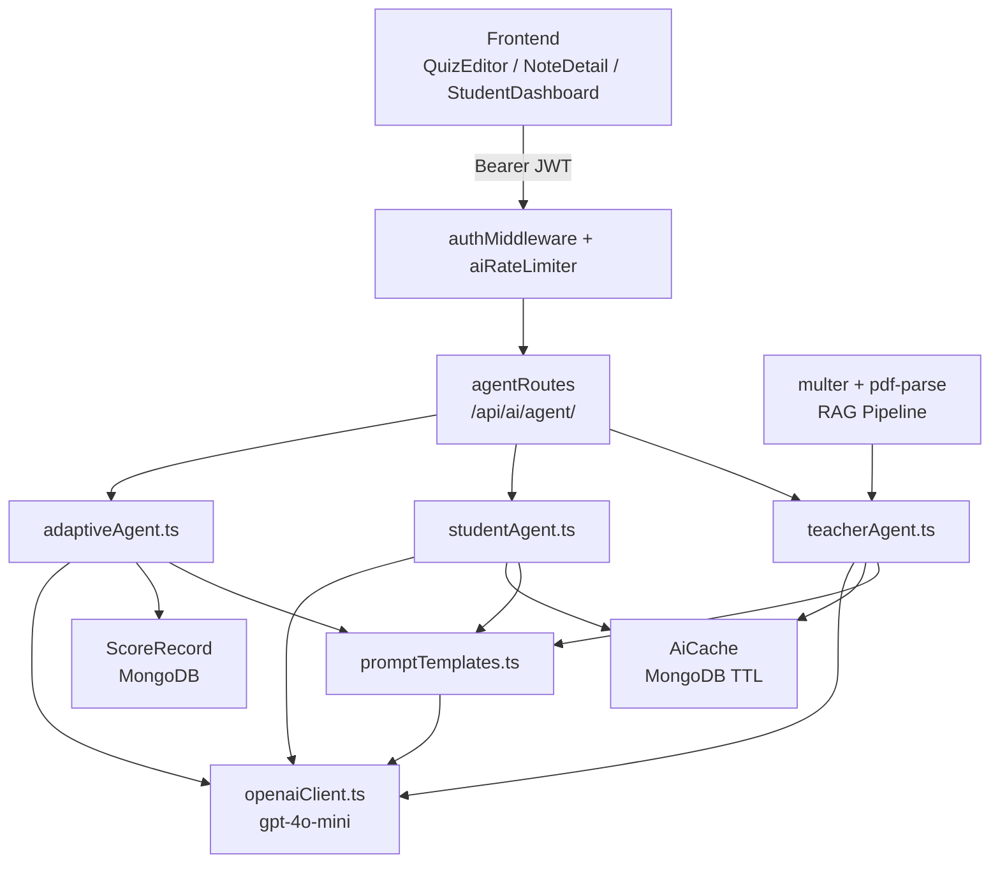

# Design Document: AI Agent System

## Overview

This document describes the design for a 3-agent AI system built on top of the existing Node.js/Express + MongoDB stack. The system introduces a dedicated `server/ai/` module powered by OpenAI `gpt-4o-mini`, replacing and extending the current Python-proxied AI routes with structured, role-specific agents.

Three agents handle distinct responsibilities:
- **TeacherAgent** — quiz generation from topic, difficulty, and question type (including PDF-based RAG)
- **StudentAgent** — structured study notes from topic or raw note text
- **AdaptiveAgent** — personalized quiz generation based on student performance history

All agent endpoints are gated behind per-user rate limiting (5 req/min) and MongoDB-backed response caching (24h TTL, SHA-256 keyed). The adaptive agent bypasses caching since its output is personalized per student.

### Key Design Decisions

- **OpenAI over Gemini/Python**: Consolidates AI calls into a single SDK (`openai` npm package), eliminating the Python FastAPI dependency for new features while leaving existing routes intact.
- **MongoDB caching over Redis**: Consistent with the existing stack (no Redis dependency). TTL index handles expiry natively.
- **In-memory rate limiter**: A `Map<userId, timestamps[]>` is sufficient for a single-process server. If the app scales horizontally, this can be replaced with a Redis-backed limiter without changing the middleware interface.
- **RAG via pdf-parse**: Lightweight, no external service needed. Multer handles upload buffering in memory (no disk writes).

---

## Architecture



### Request Flow

1. Frontend sends authenticated request to `/api/ai/agent/*`
2. `protect` middleware validates JWT, attaches `req.user`
3. `aiRateLimiter` checks sliding window for `req.user._id`; returns 429 if exceeded
4. Route handler computes cache key (SHA-256), checks `AiCache` (skipped for adaptive)
5. On cache hit: return cached response
6. On cache miss: call agent → agent builds prompt via `promptTemplates` → calls OpenAI → parses response → stores in cache → returns to client

---

## Components and Interfaces

### `server/ai/openaiClient.ts`

Singleton OpenAI client. Logs a warning if `OPENAI_API_KEY` is missing at startup.

```typescript
import OpenAI from 'openai';

if (!process.env.OPENAI_API_KEY) {
  console.warn('OPENAI_API_KEY is not set — AI agent routes will fail');
}

export const openai = new OpenAI({ apiKey: process.env.OPENAI_API_KEY });
```

### `server/ai/promptTemplates.ts`

Exports one typed prompt-builder per agent action. All prompts instruct the model to return raw JSON only (no markdown fences).

```typescript
export function buildTeacherQuizPrompt(params: {
  topic: string;
  difficulty: 'easy' | 'medium' | 'hard';
  count: number;
  questionType: 'mcq' | 'subjective' | 'poll';
  context?: string; // RAG: extracted PDF text
}): string

export function buildStudentNotesPrompt(params: {
  topic: string;
  noteText?: string;
}): string

export function buildAdaptiveQuizPrompt(params: {
  weakTopics: string[];
  difficulty?: 'easy' | 'medium' | 'hard';
  count: number;
  fallbackTopic?: string;
}): string
```

### `server/ai/teacherAgent.ts`

```typescript
export interface MCQQuestion {
  questionText: string;
  options: [string, string, string, string]; // exactly 4
  correctAnswer: 'A' | 'B' | 'C' | 'D';
  explanation: string;
  difficulty: 'easy' | 'medium' | 'hard';
  topic: string;
}

export interface SubjectiveQuestion {
  questionText: string;
  modelAnswer: string;
  rubric: string;
  difficulty: 'easy' | 'medium' | 'hard';
  topic: string;
}

export interface PollQuestion {
  questionText: string;
  options: string[]; // 2–6 options, no correct answer
  topic: string;
}

export type TeacherQuestion = MCQQuestion | SubjectiveQuestion | PollQuestion;

export async function generateTeacherQuiz(params: {
  topic: string;
  difficulty: 'easy' | 'medium' | 'hard';
  count: number;
  questionType: 'mcq' | 'subjective' | 'poll';
  context?: string;
}): Promise<TeacherQuestion[]>
```

Throws `{ message: 'AI response parse error', raw: string }` on unparseable OpenAI output.

### `server/ai/studentAgent.ts`

```typescript
export interface StudentNotes {
  summary: string;
  keyConcepts: string[];
  importantQuestions: string[];
}

export async function generateStudentNotes(params: {
  topic: string;
  noteText?: string;
}): Promise<StudentNotes>
```

### `server/ai/adaptiveAgent.ts`

```typescript
export interface WeakTopicResult {
  subject: string;
  avgPercentage: number;
}

export async function getWeakTopics(userId: string): Promise<WeakTopicResult[]>

export async function generateAdaptiveQuiz(params: {
  userId: string;
  topic?: string;
  difficulty?: 'easy' | 'medium' | 'hard';
  count?: number;
}): Promise<MCQQuestion[]>
```

`getWeakTopics` queries `ScoreRecord`, groups by `subject`, takes the 10 most recent per subject, and returns subjects where `avg(percentage) < 70`.

### `server/middleware/aiRateLimiter.ts`

```typescript
// In-memory sliding window: Map<userId, number[]> (timestamps in ms)
export const aiRateLimiter: RequestHandler
```

- Window: 60,000 ms
- Limit: 5 requests
- On exceed: `res.status(429).json({ message: 'Rate limit exceeded. Maximum 5 AI requests per minute.' })`

### `server/routes/agentRoutes.ts`

Mounted at `/api/ai/agent/` in `server/index.ts`.

| Method | Path | Auth | Description |
|--------|------|------|-------------|
| POST | `/teacher/quiz` | teacher | Generate quiz from topic |
| POST | `/teacher/quiz-from-pdf` | teacher | Generate quiz from PDF (RAG) |
| POST | `/student/notes` | student | Generate structured notes |
| POST | `/adaptive/quiz` | student | Generate personalized quiz |

All routes apply `protect` + `aiRateLimiter`. Teacher routes additionally apply `authorize('teacher')`. Student routes apply `authorize('student')`.

### RAG Pipeline

`POST /api/ai/agent/teacher/quiz-from-pdf` uses:
- `multer` with `memoryStorage()`, `limits: { fileSize: 10 * 1024 * 1024 }`, `fileFilter` for `application/pdf`
- `pdf-parse` to extract text from `req.file.buffer`
- Extracted text passed as `context` to `generateTeacherQuiz`

---

## Data Models

### `server/models/AiCache.ts`

```typescript
interface IAiCache extends Document {
  cacheKey: string;      // SHA-256 hex of (agentType+topic+difficulty+count+questionType)
  agentType: string;     // 'teacher' | 'student'
  response: object;      // parsed JSON response from OpenAI
  createdAt: Date;       // TTL index: expires after 86400s
}

const AiCacheSchema = new Schema({
  cacheKey: { type: String, required: true, unique: true },
  agentType: { type: String, required: true },
  response:  { type: Schema.Types.Mixed, required: true },
  createdAt: { type: Date, default: Date.now },
});

AiCacheSchema.index({ createdAt: 1 }, { expireAfterSeconds: 86400 });
AiCacheSchema.index({ cacheKey: 1 }, { unique: true });
```

### Cache Key Generation

```typescript
import { createHash } from 'crypto';

function buildCacheKey(params: {
  agentType: string;
  topic: string;
  difficulty: string;
  count: number;
  questionType: string;
}): string {
  const normalized = JSON.stringify(params, Object.keys(params).sort());
  return createHash('sha256').update(normalized).digest('hex');
}
```

### Existing Models Used

- `ScoreRecord` — queried by `adaptiveAgent.getWeakTopics()` (fields: `userId`, `subject`, `percentage`, `completedAt`)
- `User` — referenced via JWT decode in `authMiddleware`

---

## Correctness Properties

*A property is a characteristic or behavior that should hold true across all valid executions of a system — essentially, a formal statement about what the system should do. Properties serve as the bridge between human-readable specifications and machine-verifiable correctness guarantees.*

### Property 1: MCQ questions have required fields and exactly one correct answer

*For any* valid teacher quiz request with `questionType: 'mcq'`, every question in the returned array must have: `questionText` (non-empty string), `options` (array of exactly 4 non-empty strings), `correctAnswer` in `['A','B','C','D']`, `explanation` (non-empty string), and `difficulty` matching the requested difficulty.

**Validates: Requirements 1.1, 1.3, 1.6**

---

### Property 2: Subjective questions have model answer and rubric

*For any* valid teacher quiz request with `questionType: 'subjective'`, every question in the returned array must have `questionText`, `modelAnswer`, and `rubric` fields — and must not have an `options` or `correctAnswer` field.

**Validates: Requirements 1.4**

---

### Property 3: Poll questions have 2–6 options and no correct answer

*For any* valid teacher quiz request with `questionType: 'poll'`, every question in the returned array must have `options` with length in `[2, 6]` and must not have a `correctAnswer` field.

**Validates: Requirements 1.5**

---

### Property 4: Student notes output schema invariant

*For any* valid student notes request with a non-empty topic, the response must be an object with `summary` (string), `keyConcepts` (non-empty array of strings), and `importantQuestions` (non-empty array of strings).

**Validates: Requirements 2.1, 2.3**

---

### Property 5: Weak topic threshold

*For any* set of ScoreRecord documents grouped by subject, `getWeakTopics()` must return exactly the subjects whose average `percentage` across the 10 most recent records is strictly less than 70 — and must not return any subject whose average is ≥ 70.

**Validates: Requirements 3.2**

---

### Property 6: Adaptive quiz weak topic weighting

*For any* student with identified weak topics, the generated adaptive quiz must have at least 60% of its questions targeting those weak topics (matched by the `topic` field on each question).

**Validates: Requirements 3.3**

---

### Property 7: Difficulty override is respected

*For any* adaptive quiz request that includes an explicit `difficulty` override, every returned question must have its `difficulty` field equal to the requested override value.

**Validates: Requirements 3.5**

---

### Property 8: Cache hit returns identical response without calling OpenAI

*For any* pair of identical teacher or student agent requests (same agentType, topic, difficulty, count, questionType), the second request must return a response equal to the first, and the OpenAI client must be called exactly once across both requests.

**Validates: Requirements 5.1, 5.2**

---

### Property 9: Adaptive agent responses are never cached

*For any* adaptive quiz request, after the request completes, no entry with `agentType: 'adaptive'` must exist in the `AiCache` collection.

**Validates: Requirements 5.5**

---

### Property 10: Rate limiter enforces 5 requests per user per minute

*For any* authenticated user, after exactly 5 requests to `/api/ai/agent/*` within a 60-second window, the 6th request must receive HTTP 429 with message `"Rate limit exceeded. Maximum 5 AI requests per minute."` — and a different user making requests concurrently must not be affected.

**Validates: Requirements 4.1, 4.2, 4.3**

---

### Property 11: RAG pipeline extracts text and produces valid MCQ schema

*For any* valid PDF file containing extractable text, the `/teacher/quiz-from-pdf` endpoint must return questions conforming to the same MCQ schema as Property 1 (question text, 4 options, correct answer, explanation, difficulty tag).

**Validates: Requirements 6.1, 6.5, 6.6**

---

### Property 12: Frontend button disables during in-flight AI request

*For any* AI action button (Generate Quiz, Generate Notes, Practice Smart Quiz), while the corresponding API request is pending, the button must have `disabled=true` and render a loading indicator.

**Validates: Requirements 8.4**

---

### Property 13: Frontend displays inline error on AI failure

*For any* AI request that returns an error response, the error message must appear inline near the triggering button without a page navigation occurring.

**Validates: Requirements 8.5**

---

## Error Handling

| Scenario | HTTP Status | Message |
|----------|-------------|---------|
| Empty topic | 400 | `"topic is required"` |
| Note text > 10,000 chars | 400 | `"note text exceeds maximum length"` |
| Non-PDF upload | 400 | `"Only PDF files are accepted"` |
| PDF > 10 MB | 400 | `"File size exceeds 10 MB limit"` |
| Image-only PDF (no text) | 422 | `"No extractable text found in PDF"` |
| Rate limit exceeded | 429 | `"Rate limit exceeded. Maximum 5 AI requests per minute."` |
| OpenAI parse failure | 500 | `"AI response parse error"` |
| OpenAI API error | 500 | `"AI service unavailable"` |
| Missing OPENAI_API_KEY | startup warn | `"OPENAI_API_KEY is not set — AI agent routes will fail"` |

All agent functions wrap OpenAI calls in try/catch. Parse errors log the raw response before throwing. The route handlers catch all errors and return structured JSON — no stack traces leak to the client.

---

## Testing Strategy

### Dual Testing Approach

Both unit tests and property-based tests are required. Unit tests cover specific examples, integration points, and error conditions. Property tests verify universal correctness across randomized inputs.

### Unit Tests

Focus areas:
- `getWeakTopics()` with specific score record fixtures (empty, all strong, mixed)
- `buildCacheKey()` determinism — same inputs always produce same hash
- `aiRateLimiter` — exactly 5 requests pass, 6th returns 429
- Error responses: empty topic, oversized note text, non-PDF upload, image-only PDF
- `OPENAI_API_KEY` missing warning at module load
- Route existence: all 4 agent endpoints respond (with mocked agents)

### Property-Based Tests

Library: **fast-check** (TypeScript-native, works with Vitest/Jest)

Each property test runs a minimum of **100 iterations**.

Tag format: `// Feature: ai-agent-system, Property {N}: {property_text}`

| Property | Test Description | Generator |
|----------|-----------------|-----------|
| P1 | MCQ schema invariant | `fc.record({ topic: fc.string(), difficulty: fc.constantFrom('easy','medium','hard'), count: fc.integer({min:1,max:20}) })` |
| P2 | Subjective schema invariant | Same as P1 with `questionType: 'subjective'` |
| P3 | Poll option count in [2,6] | Same as P1 with `questionType: 'poll'` |
| P4 | Student notes schema | `fc.record({ topic: fc.string({minLength:1}), noteText: fc.option(fc.string({maxLength:10000})) })` |
| P5 | Weak topic threshold | `fc.array(fc.record({ subject: fc.string(), percentage: fc.float({min:0,max:100}), completedAt: fc.date() }))` |
| P6 | Adaptive 60% weak topic weighting | `fc.array(weakTopicArb, {minLength:1})` + `fc.integer({min:5,max:20})` |
| P7 | Difficulty override respected | `fc.constantFrom('easy','medium','hard')` |
| P8 | Cache hit, single OpenAI call | `fc.record({ topic: fc.string({minLength:1}), difficulty: ..., count: ..., questionType: ... })` |
| P9 | Adaptive never cached | `fc.record({ userId: fc.string(), topic: fc.string() })` |
| P10 | Rate limiter per-user isolation | `fc.array(fc.string(), {minLength:2, maxLength:5})` (user IDs) |
| P11 | RAG MCQ schema | Valid PDF buffer generator |
| P12 | Button disabled during request | React Testing Library + mock fetch that never resolves |
| P13 | Inline error on failure | React Testing Library + mock fetch that rejects |

### Integration Tests

- Full request cycle: POST to `/api/ai/agent/teacher/quiz` with mocked OpenAI → verify cache write → repeat request → verify cache read (OpenAI called once)
- Adaptive flow: seed ScoreRecords → POST to `/api/ai/agent/adaptive/quiz` → verify weak topics used in prompt
