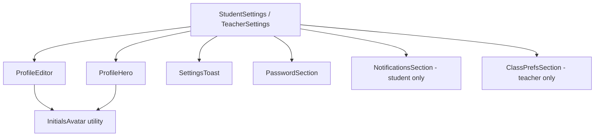

# Design Document: Profile Settings Redesign

## Overview

This redesign modernises the two existing settings pages (`StudentSettings` and `TeacherSettings`) and the shared `ProfileEditor` component. The goal is to introduce a visually prominent profile hero section, live avatar preview, inline validation, a unified toast notification system, and role-appropriate theming — while preserving all existing functionality.

The changes are scoped to three files plus a new shared toast utility:

- `src/components/ProfileEditor.tsx` — updated with live avatar preview and on-blur validation
- `src/pages/StudentSettings.tsx` — updated with Profile_Hero, toast system, and new layout
- `src/pages/TeacherSettings.tsx` — updated with Profile_Hero, toast system, and new layout
- `src/components/SettingsToast.tsx` — new generic toast component for settings pages

No new routes, no new Firestore collections, and no changes to `UserProfile` type are required.

---

## Architecture



The settings pages act as the top-level orchestrators. They own all async state (loading, error, success) and pass callbacks down to section components. Toast state is managed at the page level so only one toast is ever visible at a time.

`ProfileEditor` becomes a self-contained form that calls an `onSaved` callback on success, allowing the parent page to trigger a toast.

---

## Components and Interfaces

### `SettingsToast`

A new generic toast component replacing the badge-specific `ToastNotification` for settings pages.

```tsx
interface SettingsToastProps {
  message: string;
  type: 'success' | 'error';
  onDismiss: () => void;
  autoDismissMs?: number; // default 3000 for success, undefined (manual) for error
}
```

- Positioned `fixed bottom-6 right-6 z-50`
- Success: auto-dismisses after `autoDismissMs` (3 000 ms)
- Error: persists until user clicks ×
- Only one instance rendered at a time (parent controls visibility)

### `ProfileHero`

Rendered at the top of both settings pages. Reads from `userProfile` via `useAuth()`.

```tsx
interface ProfileHeroProps {
  displayName: string;
  avatarUrl?: string | null;
  role: 'student' | 'teacher';
  streak: number;
}
```

- Avatar: 80 × 80 px circle; image if `avatarUrl` is set, else `InitialsAvatar`
- Border colour: `#6366F1` (student) or `#FF5C1A` (teacher)
- Role badge: "Student" / "Teacher" with matching accent background
- Streak: flame emoji + numeric value

### `InitialsAvatar` (utility function)

```ts
function getInitialsAvatar(displayName: string): string
// Returns the first letter of each whitespace-separated word, uppercased, max 2 chars
// e.g. "Jane Doe" → "JD", "Alice" → "A"
```

Used in both `ProfileHero` and `ProfileEditor` preview.

### `ProfileEditor` (updated)

New props shape:

```tsx
interface ProfileEditorProps {
  role: 'student' | 'teacher';
  onSaved?: (message: string) => void;  // replaces internal success state
  onError?: (message: string) => void;  // replaces internal error state
}
```

Key changes:
- Live avatar preview (64 × 64 px circle) rendered next to the URL input, debounced 300 ms
- On-blur validation for display name (not on-change)
- Save button disabled while validation error is present
- Calls `onSaved` / `onError` instead of managing its own success/error UI

---

## Data Models

No new data models. The existing `UserProfile` interface already contains all required fields:

```ts
interface UserProfile {
  uid: string;
  email: string;
  displayName: string;
  role: 'student' | 'teacher';
  avatarUrl?: string | null;
  streak: number;
  lastActiveDate: string;
  notificationPrefs?: { newQuizInSubject: boolean };
  defaultSubject?: string | null;
}
```

### Toast State (page-level)

```ts
interface ToastState {
  message: string;
  type: 'success' | 'error';
} | null
```

Stored in `useState<ToastState | null>` at the page level. Setting a new value replaces any existing toast.

### Validation State (ProfileEditor-level)

```ts
interface ValidationState {
  displayNameError: string | null;
}
```

Errors are set on blur, cleared when the field value becomes valid.

---

## Correctness Properties

*A property is a characteristic or behavior that should hold true across all valid executions of a system — essentially, a formal statement about what the system should do. Properties serve as the bridge between human-readable specifications and machine-verifiable correctness guarantees.*

### Property 1: Initials derived from display name

*For any* display name string, when no valid avatar URL is present, the avatar shown (in both `ProfileHero` and `ProfileEditor` preview) should display the first letter of each whitespace-separated word, uppercased, and contain at most 2 characters.

**Validates: Requirements 1.3, 2.2**

### Property 2: Profile Hero renders display name

*For any* `UserProfile`, the `ProfileHero` component should render the `displayName` value as visible text in the primary heading.

**Validates: Requirements 1.4**

### Property 3: Profile Hero renders streak value

*For any* non-negative integer streak value, the `ProfileHero` component should render that exact number alongside the flame indicator.

**Validates: Requirements 1.6**

### Property 4: Avatar preview updates with URL input

*For any* non-empty URL string typed into the avatar URL field, the `ProfileEditor` preview image `src` attribute should equal that URL after the debounce period.

**Validates: Requirements 2.1**

### Property 5: Validation error disables save and clears on valid input

*For any* display name that is invalid (empty or longer than 50 characters), the save button should be disabled while the error is shown; and *for any* subsequent valid display name entered into the same field, the error message should be cleared and the save button re-enabled.

**Validates: Requirements 3.1, 3.2, 3.3, 3.4**

### Property 6: Short passwords are rejected

*For any* password string of length 1–7, submitting the Change Password form should display the error "New password must be at least 8 characters." and not call `updatePassword`.

**Validates: Requirements 5.3**

### Property 7: At most one toast visible at a time

*For any* sequence of save operations (success or failure), the settings page should render at most one `SettingsToast` component at any point in time; each new toast replaces the previous one.

**Validates: Requirements 4.3**

### Property 8: Notification toggle persists to Firestore

*For any* boolean toggle value, when the student toggles the notification preference, the value written to Firestore should equal the new toggle state; and if the write fails, the toggle should revert to its previous state.

**Validates: Requirements 6.2, 6.3**

### Property 9: Default subject pre-populated from UserProfile

*For any* `UserProfile.defaultSubject` value (including null/empty), the Default Subject input field should be pre-populated with that value when the teacher settings page mounts.

**Validates: Requirements 7.2**

### Property 10: Default subject length validation

*For any* string longer than 50 characters entered into the Default Subject field, the form should display an inline error and the submit button should be disabled.

**Validates: Requirements 7.3**

---

## Error Handling

| Scenario | Behaviour |
|---|---|
| Avatar image URL fails to load | `onError` on `` triggers fallback to `InitialsAvatar` |
| Reauthentication fails (wrong password) | Inline error "Incorrect current password." shown in password section |
| `updatePassword` Firebase error | Error message from `err.message` shown inline |
| Firestore write fails (notification toggle) | Toggle reverts; error toast shown |
| Firestore write fails (class preferences) | Error toast: "Failed to save preferences. Please try again." |
| Firestore write fails (profile save) | `onError` callback triggers error toast on parent page |
| User not signed in | Inline error shown; no Firebase calls made |

All async operations follow the pattern: set loading → try/catch → clear loading → call success or error callback.

---

## Testing Strategy

### Unit Tests

Focus on specific examples, edge cases, and integration points:

- `ProfileHero` renders correct role badge text for both roles
- `ProfileHero` renders avatar image when `avatarUrl` is set
- `ProfileHero` renders `InitialsAvatar` when `avatarUrl` is null/empty
- `ProfileEditor` shows initials fallback when image `onError` fires
- `ProfileEditor` calls `onSaved` after successful profile update
- `SettingsToast` auto-dismisses after 3 000 ms for success type (using fake timers)
- `SettingsToast` does not auto-dismiss for error type
- Password section calls `reauthenticateWithCredential` before `updatePassword`
- Password section clears fields and calls success callback on success
- Notification toggle reverts on Firestore failure
- `StudentSettings` renders `StudentNavbar`
- `TeacherSettings` renders `TeacherSidebar`
- Page title is "Settings – QuizMaster"

### Property-Based Tests

Use **fast-check** (already used in the codebase at `src/lib/adaptiveQuiz.property.test.ts`). Each property test runs a minimum of 100 iterations.

**File:** `src/components/ProfileEditor.property.test.ts`

```
// Feature: profile-settings-redesign, Property 1: Initials derived from display name
// Feature: profile-settings-redesign, Property 4: Avatar preview updates with URL input
// Feature: profile-settings-redesign, Property 5: Validation error disables save and clears on valid input
```

**File:** `src/pages/Settings.property.test.ts`

```
// Feature: profile-settings-redesign, Property 3: Profile Hero renders streak value
// Feature: profile-settings-redesign, Property 6: Short passwords are rejected
// Feature: profile-settings-redesign, Property 7: At most one toast visible at a time
// Feature: profile-settings-redesign, Property 8: Notification toggle persists to Firestore
// Feature: profile-settings-redesign, Property 9: Default subject pre-populated from UserProfile
// Feature: profile-settings-redesign, Property 10: Default subject length validation
```

Each property-based test must:
- Reference its design property in a comment using the tag format above
- Run at minimum 100 iterations (`fc.assert(fc.property(...), { numRuns: 100 })`)
- Be implemented as a single test per property
