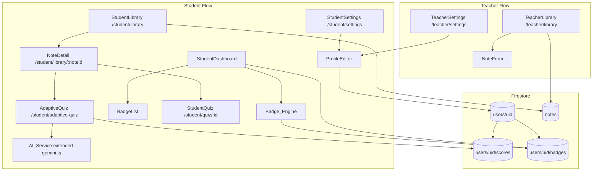
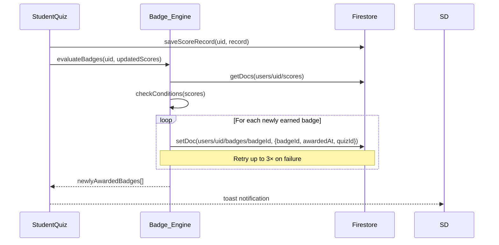
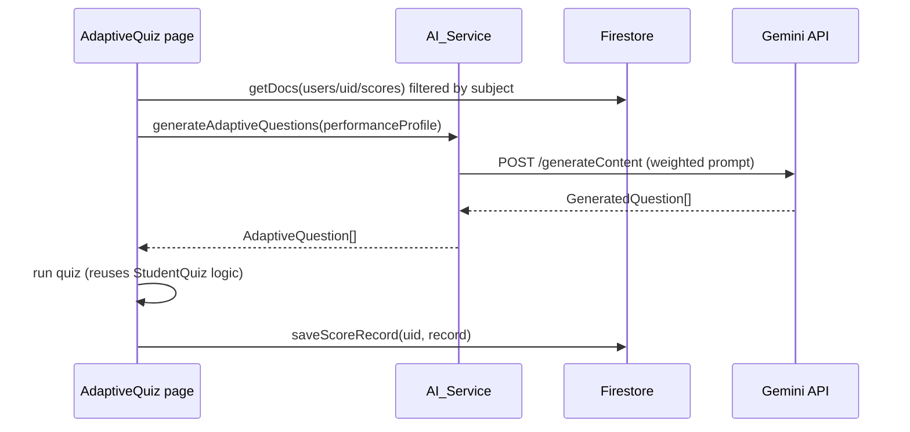

# Design Document: Student Profile Enhancements

## Overview

This document describes the technical design for four interconnected feature areas added to QuizMaster:

1. **Badges System** — A `Badge_Engine` that evaluates achievement conditions after quiz completion and writes badge records to a Firestore subcollection, with dashboard display and toast notifications.
2. **Student Library / Notes Section** — A student-facing page at `/student/library` for browsing teacher-published notes by subject, with a note detail page that links to standard or adaptive quizzes.
3. **AI-Based Adaptive Quiz System** — A Gemini-powered quiz generator that builds a `Performance_Profile` from the student's `ScoreRecord` history and generates difficulty-weighted questions targeting weak areas.
4. **Settings & Profile Pages** — Profile editing and account preferences for both student and teacher roles, backed by Firebase Auth and Firestore.

The design builds directly on the existing stack: React + TypeScript + Vite, Firebase Auth + Firestore, Gemini AI (`src/lib/gemini.ts`), Tailwind CSS, React Router v6, and the existing `AuthContext`, `StudentNavbar`, `TeacherSidebar`, `StudentDashboard`, `Library`, `StudentQuiz`, and `QuizResultsSummary` components.

---

## Architecture

### High-Level Component Map



### Data Flow: Badge Award



### Data Flow: Adaptive Quiz Generation



---

## Components and Interfaces

### New Pages

| Route | Component | Guard |
|---|---|---|
| `/student/library` | `StudentLibrary` | `StudentRoute` |
| `/student/library/:noteId` | `NoteDetail` | `StudentRoute` |
| `/student/adaptive-quiz` | `AdaptiveQuiz` | `StudentRoute` |
| `/student/settings` | `StudentSettings` | `StudentRoute` |
| `/teacher/settings` | `TeacherSettings` | `ProtectedRoute` |

### New Utility / Service Files

| File | Purpose |
|---|---|
| `src/lib/badgeEngine.ts` | Badge condition evaluation and Firestore writes |
| `src/lib/adaptiveQuiz.ts` | `Performance_Profile` builder + Gemini prompt construction |
| `src/hooks/useBadges.ts` | Firestore listener for `users/{uid}/badges` |
| `src/hooks/useNotes.ts` | Firestore query for `notes` collection |
| `src/components/BadgeList.tsx` | Badge grid with icon, name, date |
| `src/components/ToastNotification.tsx` | Transient toast for badge awards |
| `src/components/ProfileEditor.tsx` | Shared profile edit form (student + teacher) |
| `src/components/NoteCard.tsx` | Card used in StudentLibrary grid |

### Badge_Engine Interface

```typescript
// src/lib/badgeEngine.ts

export type BadgeId =
  | 'first_quiz'
  | 'streak_3'
  | 'streak_7'
  | 'perfect_score'
  | 'high_achiever'
  | 'improvement';

export interface BadgeRecord {
  badgeId: BadgeId;
  awardedAt: string;   // ISO timestamp
  quizId: string | null;
}

export interface BadgeDefinition {
  id: BadgeId;
  name: string;
  description: string;
  icon: string;        // emoji or lucide icon name
  evaluate: (scores: ScoreRecord[], streak: number) => { earned: boolean; quizId?: string };
}

/**
 * Evaluates all badge conditions for a student and writes newly earned
 * badges to Firestore. Returns the list of newly awarded badges.
 */
export async function evaluateBadges(
  uid: string,
  scores: ScoreRecord[],
  streak: number
): Promise<BadgeRecord[]>;
```

### AI_Service Adaptive Interface

```typescript
// src/lib/adaptiveQuiz.ts

export interface PerformanceProfile {
  subject: string;
  recentScores: Array<{ percentage: number; difficulty: 'easy' | 'medium' | 'hard' }>;
  weakTopics: string[];          // derived from incorrect answer text
  dominantWeakDifficulty: 'easy' | 'medium' | 'hard';
}

export function buildPerformanceProfile(
  scores: ScoreRecord[],
  subject: string
): PerformanceProfile;

export async function generateAdaptiveQuestions(
  profile: PerformanceProfile,
  noteContent: string,
  numQuestions: number          // 5–20
): Promise<GeneratedQuestion[]>;
```

### Note Data Interface

```typescript
// Extends src/types/student.ts

export interface Note {
  id: string;
  title: string;
  subject: string;
  content: string;
  authorUid: string;
  linkedQuizId: string | null;
  published: boolean;
  createdAt: string;
  updatedAt: string;
}
```

### ProfileEditor Props

```typescript
interface ProfileEditorProps {
  role: 'student' | 'teacher';
  onSaved?: () => void;
}
```

---

## Data Models

### Firestore Collections

#### `notes/{noteId}`

```
{
  id: string,
  title: string,           // required, 1–200 chars
  subject: string,         // required
  content: string,         // required, markdown or plain text
  authorUid: string,       // teacher's Firebase uid
  linkedQuizId: string | null,
  published: boolean,      // default false
  createdAt: string,       // ISO timestamp
  updatedAt: string        // ISO timestamp
}
```

#### `users/{uid}/badges/{badgeId}`

```
{
  badgeId: string,         // one of BadgeId union
  awardedAt: string,       // ISO timestamp
  quizId: string | null    // quiz that triggered the award, if applicable
}
```

#### `users/{uid}` — extended fields

```
{
  // existing fields (uid, email, displayName, role, streak, lastActiveDate)
  avatarUrl: string | null,
  notificationPrefs: {
    newQuizInSubject: boolean   // default false
  },
  defaultSubject: string | null  // teacher only, max 50 chars
}
```

### Badge Definitions

| Badge ID | Condition |
|---|---|
| `first_quiz` | `scores.length >= 1` |
| `streak_3` | `streak >= 3` |
| `streak_7` | `streak >= 7` |
| `perfect_score` | `any score.percentage === 100` |
| `high_achiever` | `scores.length >= 10 && avg(scores.percentage) >= 80` |
| `improvement` | `same quizId appears ≥ 2×, latest percentage − earliest percentage >= 20` |

### Extended `UserProfile` Type

```typescript
// src/types/student.ts additions
export interface UserProfile {
  // ... existing fields
  avatarUrl?: string | null;
  notificationPrefs?: {
    newQuizInSubject: boolean;
  };
  defaultSubject?: string | null; // teacher only
}
```

### Firestore Security Rules Extensions

```
// notes collection
match /notes/{noteId} {
  allow read: if request.auth != null;
  allow create: if request.auth != null
    && request.resource.data.authorUid == request.auth.uid;
  allow update, delete: if request.auth != null
    && resource.data.authorUid == request.auth.uid;
}

// badges subcollection
match /users/{uid}/badges/{badgeId} {
  allow read: if request.auth != null && request.auth.uid == uid;
  allow write: if request.auth != null && request.auth.uid == uid;
}
```

---

## Correctness Properties

*A property is a characteristic or behavior that should hold true across all valid executions of a system — essentially, a formal statement about what the system should do. Properties serve as the bridge between human-readable specifications and machine-verifiable correctness guarantees.*

### Property 1: Badge idempotence

*For any* student uid and any badge type, evaluating badge conditions multiple times against the same score history should result in at most one badge record of that type in `users/{uid}/badges`.

**Validates: Requirements 1.4**

---

### Property 2: Badge condition correctness

*For any* collection of `ScoreRecord` objects and a streak value, the `Badge_Engine` should award exactly the set of badges whose conditions are satisfied by that input — no more, no fewer.

**Validates: Requirements 1.1, 1.2**

---

### Property 3: Note filter correctness

*For any* list of `Note` objects, a subject filter value, and a search query string, the filtered result should contain only notes whose `subject` matches the filter (when not "all") and whose `title` or `subject` contains the query string (case-insensitive).

**Validates: Requirements 3.3, 3.4**

---

### Property 4: Note filter is a subset

*For any* list of notes and any filter/query combination, the filtered result length should be less than or equal to the unfiltered length.

**Validates: Requirements 3.3, 3.4**

---

### Property 5: Adaptive question count bounds

*For any* `PerformanceProfile` and note content, the `generateAdaptiveQuestions` function should return between 5 and 20 questions inclusive.

**Validates: Requirements 6.2**

---

### Property 6: Adaptive difficulty weighting

*For any* `PerformanceProfile` where `dominantWeakDifficulty` is set, the generated question set should contain more questions of that difficulty tier than any other tier.

**Validates: Requirements 6.1, 6.2**

---

### Property 7: Score record round-trip

*For any* completed adaptive quiz session, saving the result as a `ScoreRecord` and then reading it back from `users/{uid}/scores` should return a record with the same `quizId`, `score`, `total`, and `percentage`.

**Validates: Requirements 6.6**

---

### Property 8: Profile display name validation

*For any* string submitted as a `displayName`, the `ProfileEditor` should accept it if and only if its trimmed length is between 1 and 50 characters inclusive.

**Validates: Requirements 8.2, 8.4, 9.2**

---

### Property 9: Performance profile weak difficulty derivation

*For any* collection of `ScoreRecord` objects for a given subject, `buildPerformanceProfile` should set `dominantWeakDifficulty` to the difficulty tier with the lowest average percentage score across those records.

**Validates: Requirements 6.1**

---

## Error Handling

### Badge_Engine Failures

- Firestore write failures during badge award are retried up to 3 times with exponential backoff (100 ms, 200 ms, 400 ms).
- After 3 failures the error is logged to `console.error` and the badge award is skipped silently — quiz completion is never blocked.
- The `evaluateBadges` function is called asynchronously after `saveScoreRecord` resolves; it does not sit in the critical path.

### Adaptive Quiz Generation Failures

- The `AdaptiveQuiz` page sets a 15-second `AbortController` timeout on the Gemini API call.
- On timeout or API error, the page renders an error state with a "Try Again" button (re-triggers generation) and a fallback link to `/student` (standard quiz browse).
- If `buildPerformanceProfile` finds no score history for the subject, it defaults to `dominantWeakDifficulty: 'medium'` and `weakTopics: []`, allowing generation to proceed with a general prompt.

### Note Not Found

- The `NoteDetail` page checks the Firestore response; if the document does not exist (`!docSnap.exists()`), it renders a "Note not found" message with a back link to `/student/library`.

### Profile Update Failures

- Firebase Auth `updateProfile` and Firestore `setDoc` are called sequentially. If either fails, the `ProfileEditor` displays an inline error message and does not show the success confirmation.
- Password change: if `reauthenticateWithCredential` throws `auth/wrong-password`, the component displays "Incorrect current password". All other errors display a generic "Update failed, please try again."

### Firestore Offline / Loading States

- All hooks (`useBadges`, `useNotes`) expose a `loading` boolean and an `error` value.
- Pages render skeleton placeholders while `loading` is true and an error banner when `error` is non-null.

---

## Testing Strategy

### Dual Testing Approach

Both unit tests and property-based tests are required. Unit tests cover specific examples, integration points, and error conditions. Property-based tests verify universal correctness across randomized inputs.

### Unit Tests

**Badge_Engine (`src/lib/badgeEngine.test.ts`)**
- Each badge type: one test with a score set that satisfies the condition, one that does not.
- Idempotency: calling `evaluateBadges` twice with the same scores should not produce duplicate badge writes (mock Firestore).
- Retry logic: mock Firestore to fail twice then succeed; assert the badge is eventually written.

**Note filtering (`src/utils/noteFilter.test.ts`)**
- Empty query + "all" subject returns all notes.
- Subject filter excludes non-matching notes.
- Case-insensitive search on title and subject.
- Combined filter + search.

**`buildPerformanceProfile` (`src/lib/adaptiveQuiz.test.ts`)**
- No scores → defaults to medium difficulty, empty weak topics.
- All easy scores low → `dominantWeakDifficulty: 'easy'`.
- Mixed scores → correct dominant difficulty selected.

**`ProfileEditor` component**
- Submitting empty `displayName` shows validation error, does not call Firebase.
- Submitting 51-character `displayName` shows validation error.
- Valid submission calls `updateProfile` and `setDoc`.

**`AdaptiveQuiz` page**
- Renders loading state while generating.
- Renders error state + "Try Again" button on API failure.
- On success, renders quiz questions.

### Property-Based Tests

Property-based testing uses **fast-check** (already compatible with Vitest). Each test runs a minimum of **100 iterations**.

**Tag format: `Feature: student-profile-enhancements, Property {N}: {property_text}`**

```typescript
// Property 1 — Badge idempotence
// Feature: student-profile-enhancements, Property 1: badge idempotence
fc.assert(fc.asyncProperty(
  fc.array(arbitraryScoreRecord()),
  fc.integer({ min: 0, max: 30 }),
  async (scores, streak) => {
    const first = await evaluateBadgesInMemory(scores, streak);
    const second = await evaluateBadgesInMemory(scores, streak);
    // No badge should appear in second that wasn't in first
    return second.every(b => first.some(f => f.badgeId === b.badgeId));
  }
), { numRuns: 100 });

// Property 2 — Badge condition correctness
// Feature: student-profile-enhancements, Property 2: badge condition correctness
fc.assert(fc.property(
  fc.array(arbitraryScoreRecord()),
  fc.integer({ min: 0, max: 30 }),
  (scores, streak) => {
    const awarded = evaluateBadgeConditions(scores, streak);
    return BADGE_DEFINITIONS.every(def => {
      const shouldEarn = def.evaluate(scores, streak).earned;
      const didEarn = awarded.some(b => b.badgeId === def.id);
      return shouldEarn === didEarn;
    });
  }
), { numRuns: 100 });

// Property 3 — Note filter correctness
// Feature: student-profile-enhancements, Property 3: note filter correctness
fc.assert(fc.property(
  fc.array(arbitraryNote()),
  fc.string(),
  fc.option(fc.string(), { nil: 'all' }),
  (notes, query, subject) => {
    const result = filterNotes(notes, query, subject ?? 'all');
    return result.every(n =>
      (subject === 'all' || n.subject === subject) &&
      (query === '' || n.title.toLowerCase().includes(query.toLowerCase()) ||
        n.subject.toLowerCase().includes(query.toLowerCase()))
    );
  }
), { numRuns: 100 });

// Property 4 — Note filter is a subset
// Feature: student-profile-enhancements, Property 4: note filter is a subset
fc.assert(fc.property(
  fc.array(arbitraryNote()),
  fc.string(),
  fc.string(),
  (notes, query, subject) => {
    const result = filterNotes(notes, query, subject);
    return result.length <= notes.length;
  }
), { numRuns: 100 });

// Property 8 — Profile display name validation
// Feature: student-profile-enhancements, Property 8: profile display name validation
fc.assert(fc.property(
  fc.string({ minLength: 0, maxLength: 100 }),
  (name) => {
    const trimmed = name.trim();
    const isValid = trimmed.length >= 1 && trimmed.length <= 50;
    const result = validateDisplayName(name);
    return result.valid === isValid;
  }
), { numRuns: 100 });

// Property 9 — Performance profile weak difficulty derivation
// Feature: student-profile-enhancements, Property 9: performance profile weak difficulty derivation
fc.assert(fc.property(
  fc.array(arbitraryScoreRecordWithDifficulty(), { minLength: 1 }),
  fc.string(),
  (scores, subject) => {
    const profile = buildPerformanceProfile(scores, subject);
    const avgByDifficulty = computeAvgByDifficulty(scores);
    const expectedWeak = Object.entries(avgByDifficulty)
      .sort(([, a], [, b]) => a - b)[0][0];
    return profile.dominantWeakDifficulty === expectedWeak;
  }
), { numRuns: 100 });
```

### Integration Tests

- `StudentLibrary` renders notes fetched from a Firestore emulator, applies subject filter, navigates to `NoteDetail`.
- `NoteDetail` with `linkedQuizId` shows "Practice Quiz" button; without it shows "Adaptive Practice" button.
- `StudentSettings` submits valid profile update, verifies Firebase Auth mock and Firestore mock were called.
- `BadgeList` renders correct badge icons and dates from a mock badge array.
